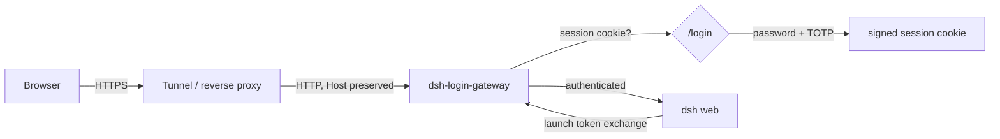

# dsh-login-gateway

A [DeepSeek Harness](https://github.com/deepseek-ai/deepseek-harness) (`dsh`) plugin that puts a **username + password + TOTP** login in front of the Web UI, so a tunnel or reverse proxy can expose the harness without exposing an unauthenticated API.



## Why this exists

`dsh web` serves the GUI over plain HTTP on a loopback port and authenticates browsers with a process launch token in the printed URL, exchanged for a signed cookie. That URL is a bearer credential: anyone who has it has the harness. That is fine on your own machine and awkward the moment the port is reachable from the internet.

This plugin adds a real login — the kind you can hand to a person or keep in a password manager — without modifying the harness. It listens on its own port, verifies credentials and a one-time code from any authenticator app, and forwards authenticated traffic (including the WebSocket stream mux) to the harness.

## What it does

- Listens on its own host and port, serving `/login`, `/logout`, and `/_dsh-login-gateway/health`.
- Verifies the username, a scrypt-hashed password, and a TOTP code, then issues its own HMAC-signed session cookie.
- Forwards every other request and WebSocket upgrade to the running harness, preserving the browser-facing `Host`.
- Performs the harness's own launch-token → cookie exchange **server-side**, so neither the launch token nor the harness's cookie ever reaches the browser.
- Asks for the first username and password when none is configured, generating the TOTP secret and storing the account as a credential record.
- Throttles failed sign-ins per client address and per username.

## Requirements

- `dsh` `0.2.1-alpha.1` (verified) or a compatible release.
- Node.js `^22.19 || >=24`.
- A Web profile (`dsh web`), which mounts the credential store first-run setup writes to.

## Install

From GitHub (a git install builds the package during installation):

```sh
dsh plugin --profile web add -w github:ButterHost69/dsh-login-gateway
```

pnpm ≥ 10 refuses to run a git dependency's `prepare` script until it is allowed. If the first `add` fails, copy the exact package key pnpm prints into `allowBuilds` in the profile's `pnpm-workspace.yaml`:

```yaml
allowBuilds:
  dsh-login-gateway: true
```

Then run the `add` again. Treat that allowance as permission to run this package's build on your machine.

From a local checkout:

```sh
dsh plugin --profile web add -w /absolute/path/to/dsh-login-gateway
```

Installing selects the bundle, which inserts the plugin row. The row starts with no users, so the plugin comes up in **first-run setup**: it serves a form that asks for the first username and password, generates the TOTP secret, and stores the account in the harness credential store.

```
dsh-login-gateway: set up at http://127.0.0.1:8080/login (forwarding to http://127.0.0.1:3080)
dsh-login-gateway: no account exists yet; open that URL on this machine, or use http://127.0.0.1:8080/login?setup=… once to set one up through a tunnel
```

## First run

Open the printed URL. On the machine running the harness, `http://127.0.0.1:8080/login` is enough. Through a tunnel, open the `?setup=…` URL once: the token is minted per process and is the only thing that lets a non-loopback peer create the first account.

The setup form asks for a username, a password, and its confirmation:

- The username becomes the credential-record id, so it is 2–32 characters of lowercase letters, digits, and hyphens, starting with a letter.
- The password must be at least 12 characters.

Submitting creates the account and shows the **enrollment page once**: a base32 secret and an `otpauth://` URI. Add it to Google Authenticator, 1Password, Aegis, or any other TOTP app, then sign in with a code to confirm enrollment. The secret is not shown again — the server keeps it to verify codes, but there is no page that reveals it later.

While no account exists, every other path answers `503` and the harness is not reachable through the gateway. Only the first account can be created this way; add further accounts declaratively, below.

## Configure accounts in the profile

For a reproducible deployment, or to add accounts after the first, declare users in configuration. The script hashes the password with scrypt and mints a fresh base32 TOTP secret:

```sh
cd /path/to/dsh-login-gateway
npm install
npm run build
node scripts/enroll.mjs --username alice
```

It prints a ready-to-paste block and an `otpauth://` URI. Paste the block into `$DSH_HOME/profiles/web/cordis.patch.yml`:

```yaml
- id: login-gateway
  config:
    listenHost: '127.0.0.1'
    listenPort: 8080
    users:
      - username: alice
        passwordHash: 'scrypt$16384$8$1$…$…'
        totpSecret: 'NOVJ3ZLTORZGK6LQ…'
```

Configured users always win over a stored record with the same name. Add the `otpauth://` URI to your authenticator app, then restart `dsh web` (or let HMR reload the profile). The startup output names the sign-in URL:

```
dsh-login-gateway: sign in at http://127.0.0.1:8080/login (forwarding to http://127.0.0.1:3080)
```

## Expose it

Point the tunnel or reverse proxy at the **gateway** port, not the harness port. Keep the harness on loopback.

If the public authority is not loopback, start `dsh` with `--trusted-host` so the harness's own Host fence admits the forwarded `Host`:

```sh
dsh web --trusted-host harness.example.com
```

The proxy must:

- **Preserve the browser-facing `Host`.** The gateway forwards it unchanged, and the harness's fence compares it against the accepted authorities.
- **Forward WebSocket upgrades** (`Upgrade` and `Connection` headers intact) so the harness's stream mux works.
- **Set `X-Forwarded-Proto: https`** on the external leg. The gateway marks the session cookie `Secure` when it sees `https`, and passes the header through to the harness.
- **Set `X-Forwarded-For`** (Cloudflare Tunnel and Caddy do this by default) and set `trustProxy: true`. Without it every request looks like it came from the proxy, so one attacker's failed attempts throttle everyone.
- **Terminate TLS.** The gateway speaks plain HTTP, exactly like the harness.

For Cloudflare Tunnel, the origin service is simply `http://127.0.0.1:8080`. For a Caddy front end:

```
harness.example.com {
  reverse_proxy 127.0.0.1:8080
}
```

## Configuration reference

Every field is optional, and every value has a default:

| Field | Default | Meaning |
| --- | --- | --- |
| `listenHost` | `'127.0.0.1'` | Bind host of the gateway. `'0.0.0.0'` exposes the plain-HTTP leg to the network; prefer loopback plus a tunnel. |
| `listenPort` | `8080` | Gateway port. `0` asks the OS for a free port. |
| `upstreamHost` | `'127.0.0.1'` | The harness web server's host. |
| `upstreamPort` | the running web server's port | Override only when the harness listens somewhere the plugin cannot read. |
| `loginPath` | `'/login'` | Login form path, and the setup form while no account exists. |
| `logoutPath` | `'/logout'` | Sign-out path. |
| `users` | `[]` | Declared accounts, each `{ username, passwordHash, totpSecret }`. An empty list means first-run setup. |
| `branding.issuer` | `'DeepSeek Harness'` | Product name on the login page. |
| `totp.digits` | `6` | Code length (`6` or `8`). |
| `totp.periodSeconds` | `30` | Seconds per time step. |
| `totp.algorithm` | `'sha1'` | `'sha1'`, `'sha256'`, or `'sha512'`. |
| `totp.windowSteps` | `1` | Steps accepted either side of the current one. |
| `session.maxAgeSeconds` | `43200` (12 h) | Session lifetime. |
| `session.cookieName` | `'dsh_login_session'` | Session cookie name. |
| `session.secure` | `'auto'` | `'auto'` marks the cookie `Secure` over HTTPS; `'always'` or `'never'` force it. |
| `rateLimit.maxFailures` | `5` | Failures within the window that trigger a lockout. |
| `rateLimit.windowSeconds` | `300` | Sliding window length. |
| `rateLimit.lockoutSeconds` | `300` | Lockout length. |
| `trustProxy` | `false` | Trust the first `X-Forwarded-For` hop as the client address for throttling. |

## Security notes

- **Passwords** are stored as scrypt hashes (`N=16384, r=8, p=1`, 16-byte salt, 32-byte key) and compared in constant time. Neither the enrollment script nor the setup form keeps the plaintext.
- **TOTP** follows RFC 6238 with the authenticator-app defaults and a ±1 step window, compared without an early exit.
- **First-run setup is local-only.** Only a loopback peer, or a peer holding the per-process setup token printed at startup, may read the setup form or create the first account. Every other request is refused with `503` until an account exists, so an exposed port is never briefly open. The token is exchanged for a short-lived cookie so it does not stay in the address bar.
- **Sessions** are random 256-bit ids in process memory, carried by an HMAC-SHA256 cookie (`HttpOnly`, `SameSite=Lax`, `Path=/`, `Secure` over HTTPS). A restart signs everyone out, and there is no persistent session store to steal. `SameSite=Lax` keeps a shared link working from another site; sign-out requires a same-origin request so no other page can end the session.
- **Brute force** is throttled per client address and per submitted username. An unknown username still spends one password derivation, so it is not answered faster than a wrong password.
- **Sign-in and setup POSTs** must be same-origin (`Origin`/`Sec-Fetch-Site`), and both pages ship under `default-src 'none'` with no scripts or third-party resources.
- **The harness credentials stay server-side.** The plugin exchanges the launch token for the harness cookie inside its own process and attaches that cookie to forwarded requests; the browser only ever holds the gateway's session cookie. A browser-supplied `dsh-auth-*` cookie is stripped.
- **Not an open proxy.** The gateway forwards only to its configured upstream.

What it deliberately does **not** do:

- **TLS.** Terminate it at the tunnel or reverse proxy.
- **Multi-user authorization.** Every authenticated browser speaks for the harness's single operator Peer, so this is a single-operator gate, not a multi-tenant one.
- **Account management after setup.** Only the first account can be created in the browser; later accounts are declared in configuration. There is no password reset, audit log, or recovery code — losing the authenticator means generating a new secret.
- **Protecting the harness port itself.** If `dsh web` is also bound to a public interface, that path is unaffected. Keep it on loopback and expose only the gateway.

## Limitations

- One upstream and no path rewriting. The harness serves origin-root routes; if your proxy mounts a prefix, configure `--public-url` on `dsh` and strip the prefix at the proxy — the gateway forwards paths unchanged.
- Sessions and throttling live in memory and are lost on restart; accounts do not, because setup writes them to the credential store.
- The login, setup, and enrollment pages are English-only.

## How it works

| File | Responsibility |
| --- | --- |
| `src/index.ts` | Cordis plugin: reads the harness port, builds the user directory and upstream cookie provider, starts and stops the gateway with the fiber. |
| `src/gateway.ts` | The gateway module: routing, first-run setup, sign-in, sign-out, throttling, session handling, and forwarding. |
| `src/proxy.ts` | HTTP/1.1 and WebSocket reverse proxy: hop-by-hop filtering, streaming bodies, upgrade tunneling. |
| `src/upstream-auth.ts` | Mints and caches the harness's cookie per browser authority via `ctx.connection.authenticatedUrl`. |
| `src/user-store.ts` | Merges configured users with credential records, and writes the account first-run setup creates. |
| `src/session.ts` | In-memory sessions and signed cookie values. |
| `src/password.ts` | scrypt hashing, parsing, and constant-time verification. |
| `src/totp.ts`, `src/base32.ts` | RFC 6238 TOTP and RFC 4648 base32. |
| `src/rate-limit.ts` | Sliding-window failure throttling. |
| `src/login-page.ts` | Server-rendered HTML with inline CSS. |
| `src/config.ts` | Config schema and load-time validation. |
| `src/types.ts` | The narrow Host service contracts this plugin consumes. |

## Development

```sh
pnpm install
pnpm run build       # tsc declarations + tsdown bundle
pnpm test            # vitest: crypto units and a real-socket integration suite
pnpm run typecheck
```

The integration suite starts a stand-in harness (token exchange, authenticated routes, and a WebSocket upgrade) and drives the gateway over real sockets: unauthenticated redirects, first-run setup and enrollment, the full sign-in flow, cookie stripping, streaming responses, 502 handling, throttling, and upgrade tunneling.

## License

MIT
